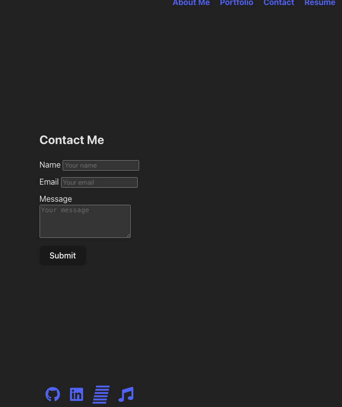
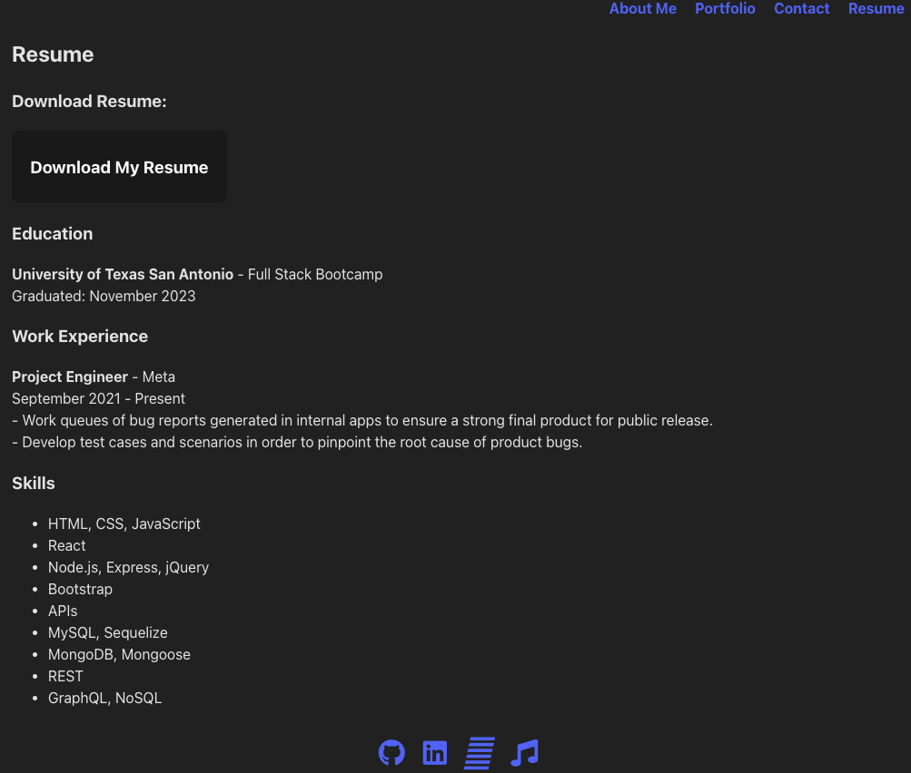
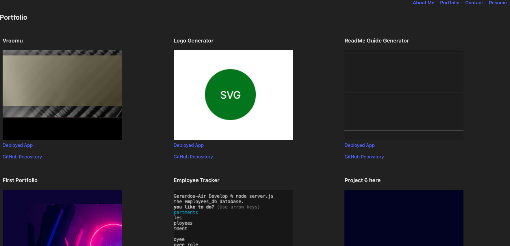
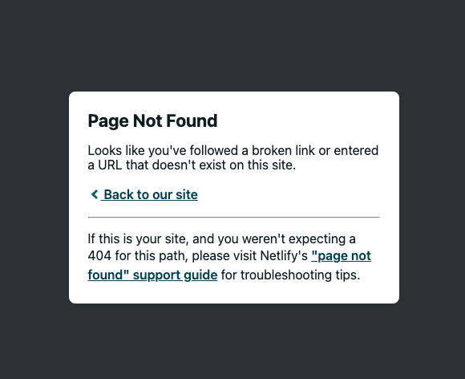

[](https://app.netlify.com/sites/20-react-portfolio/deploys)

# React Portfolio

## My Project

I have created a portfolio using my new React skills, which will help set me apart from other developers whose portfolios don’t use the latest technologies.

## User Story

```md
AS AN employer looking for candidates with experience building single-page applications
I WANT to view a potential employee's deployed React portfolio of work samples
SO THAT I can assess whether they're a good candidate for an open position
```

## Acceptance Criteria

```md
GIVEN a single-page application portfolio for a web developer
WHEN I load the portfolio
THEN I am presented with a page containing a header, a section for content, and a footer
WHEN I view the header
THEN I am presented with the developer's name and navigation with titles corresponding to different sections of the portfolio
WHEN I view the navigation titles
THEN I am presented with the titles About Me, Portfolio, Contact, and Resume, and the title corresponding to the current section is highlighted
WHEN I click on a navigation title
THEN the browser URL changes and I am presented with the corresponding section below the navigation and that title is highlighted
WHEN I load the portfolio the first time
THEN the About Me title and section are selected by default
WHEN I am presented with the About Me section
THEN I see a recent photo or avatar of the developer and a short bio about them
WHEN I am presented with the Portfolio section
THEN I see titled images of six of the developer’s applications with links to both the deployed applications and the corresponding GitHub repositories
WHEN I am presented with the Contact section
THEN I see a contact form with fields for a name, an email address, and a message
WHEN I move my cursor out of one of the form fields without entering text
THEN I receive a notification that this field is required
WHEN I enter text into the email address field
THEN I receive a notification if I have entered an invalid email address
WHEN I am presented with the Resume section
THEN I see a link to a downloadable resume and a list of the developer’s proficiencies
WHEN I view the footer
THEN I am presented with text or icon links to the developer’s GitHub and LinkedIn profiles, and their profile on a third platform (Stack Overflow, Twitter)
```

## Usage

The following images shows the web application's appearance and functionality:








For some reason it is not displaying the site even though I followed the steps. I will have to keep researching but will turn in what I have now.




## Notes

August 29, 2024: Starting to work on this again to fix the issues associated with this project. 

## Getting Started (for my personal use)

### When you would like to scaffold a new `vite` application on your own, follow these steps

1. In the command line, navigate to the desired parent folder and run `npm create vite@latest`.

    * 🔑 *Note*: This command will automatically create a sub-folder which will house your React application; you do not need to perform a `mkdir` command to create one manually.

2. Enter the desired name of your new project folder.

3. From the first list of options, select your framework; for our activities in class, we'll be using `React`.

4. From the second list of options, select your variant; for our activities in class, we'll be using `JavaScript`.

5. `cd` into your newly created project folder and run `npm install`.

    * In later activities we'll add additional NPM packages to our `vite` apps such as 'bootstrap', 'dotenv', and 'axios'.

6. Run `npm dev`/`npm run dev` and navigate to the prompted URL to see your app.

### Further customization (Recommended)

1. Navigate to your `package.json` and modify the `scripts` object so that it looks like this example:

```json
  "scripts": {
    "dev": "vite",
    "start": "vite",
    "build": "vite build",
    "lint": "eslint src --ext js,jsx --report-unused-disable-directives --max-warnings 0",
    "preview": "vite preview"
  },
```

* Note the addition of the `"start": "vite"` script.

2. Navigate to the `vite.config.js` file and edit the export object so that it looks like this example:

```js
export default defineConfig({
  plugins: [react()],
  server: {
    port: 3000,
    open: true
  }
})
```

## Links
[React Router tutorial](https://reactrouter.com/en/main/start/tutorial#tutorial)

[GitHub Repo](https://github.com/Gera1313/react-portfolio)

[Deployed Site](https://react-portfolio.netlify.app/) 

## Licenses

## [](https://opensource.org/licenses/MIT)